Node.js는 브라우저 밖에서 자바스크립트를 실행할 수 있도록 해주는 런타임 환경입니다.

원래 자바스크립트는 웹 브라우저 안에서만 동작했는데, Node.js가 등장하면서 서버, 데스크탑, IoT 기기 등 어디서든 실행이 가능하게 되었습니다.

주요 활용분야는 웹 서버, 실시간 애플리케이션, 데스크탑 엡, CLI 도구 등 입니다.

Winodws 환경에서 Node.js를 다운로드 받는 방법에 대해 알아보도록 하겠습니다.

 

Link: [https://nodejs.org/ko/download](https://nodejs.org/ko/download)

 

먼저 위 링크로 들어가서 아래 사진에 보이는 [Windows 설치 프로그램(.msi)] 버튼을 클릭하여 설치 파일을 다운로드 받습니다.

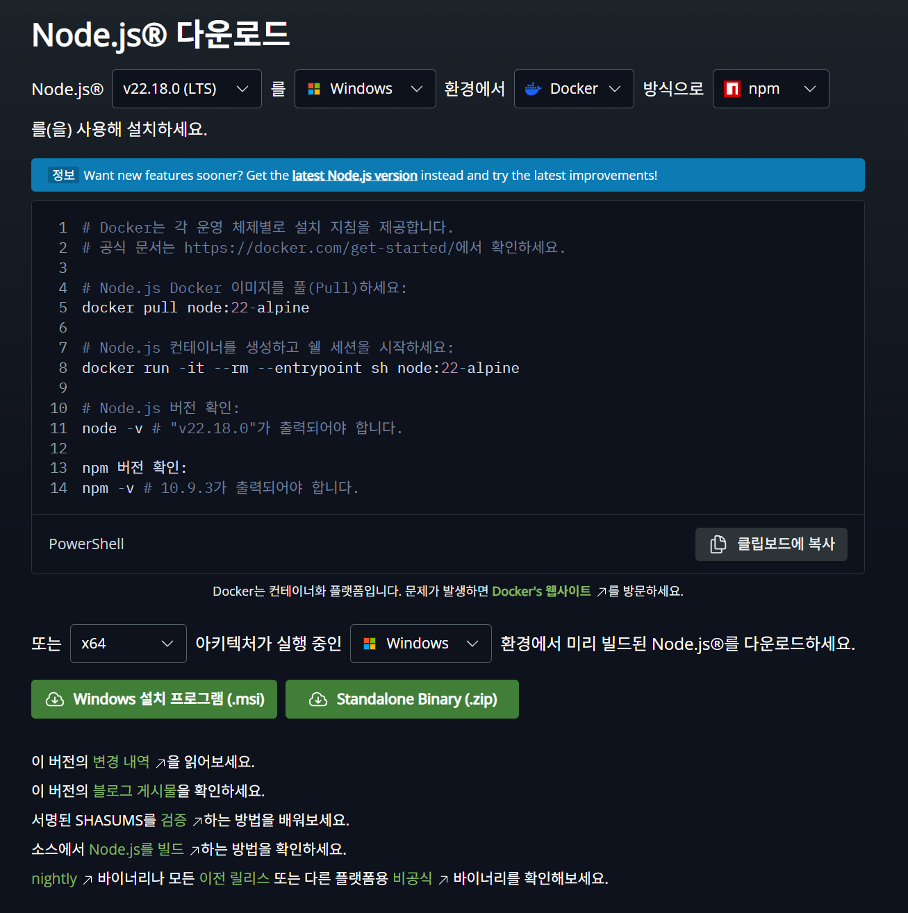{: width="90%", height="90%"}

 

다운로드가 완료되었으면 설치 파일을 실행하고 [Next] 버튼을 클릭합니다.

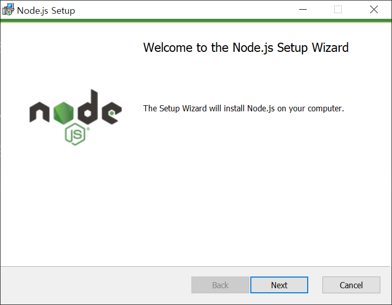{: width="90%", height="90%"}

 

라이센스 화면이 나올텐데 [agree]를 체크하고 [Next] 버튼을 클릭합니다.

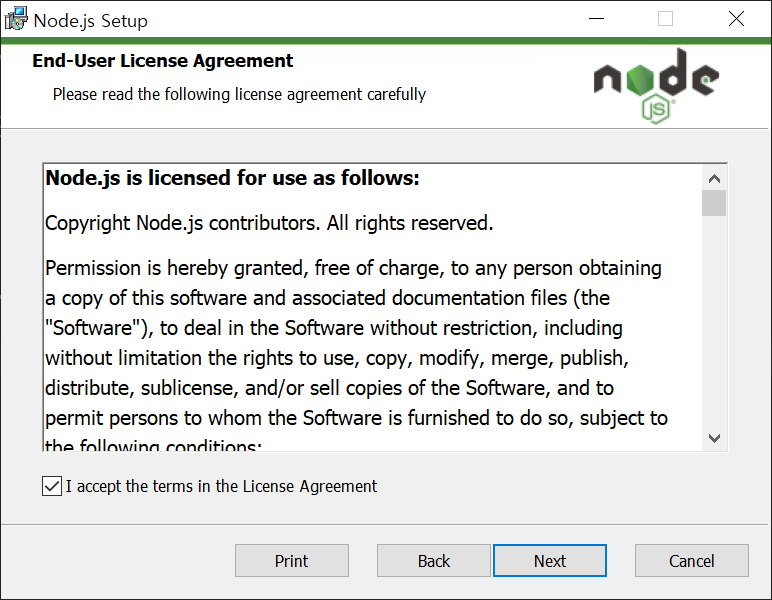{: width="90%", height="90%"}

 

설치 장소를 선택 후 [Next] 버튼을 클릭합니다.

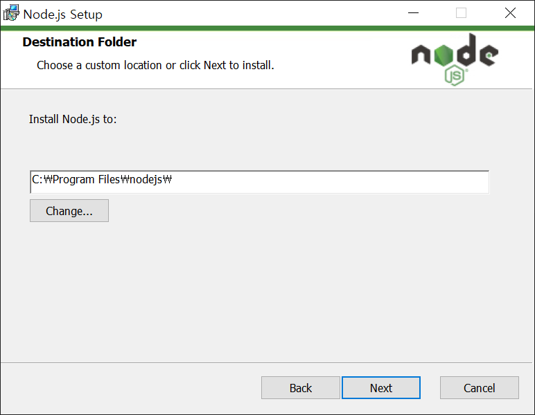{: width="90%", height="90%"}

 

셋업 부분은 그대로 두신 후 [Next] 버튼을 클릭합니다.

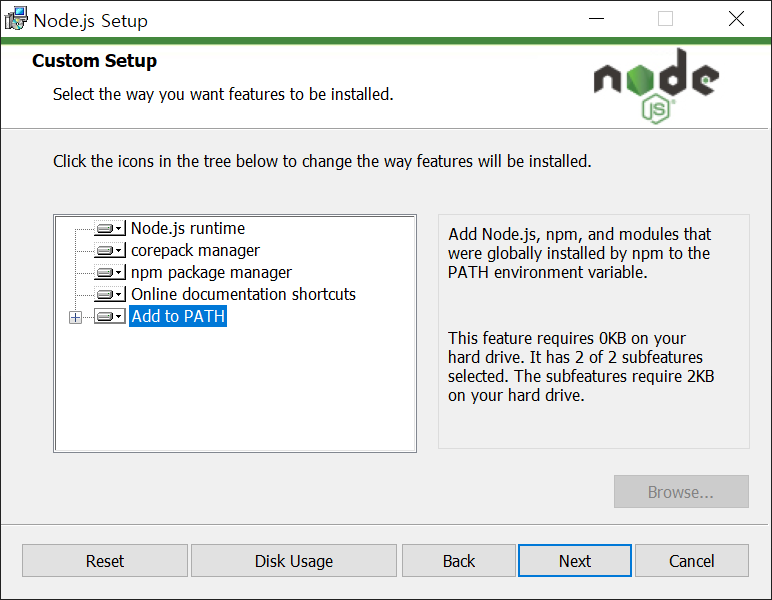{: width="90%", height="90%"}

 

필요한 툴들을 자동으로 설치할 것인지 선택하는 창입니다. [Automatically install...] 체크를 클릭 후 [Next] 버튼을 클릭합니다.

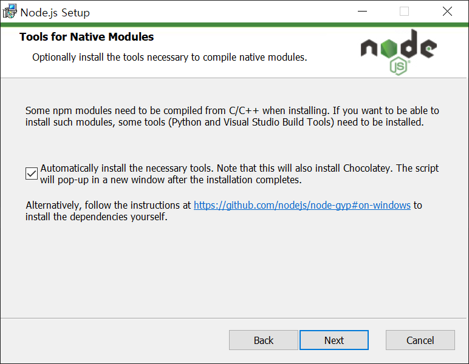{: width="90%", height="90%"}

 

[Install] 버튼을 클릭합니다.

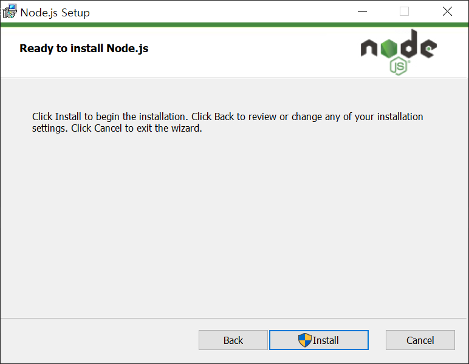{: width="90%", height="90%"}

 

마지막으로 [Finish] 버튼을 클릭합니다. 중간에 접근 권한 허용에 대한 팝업이 뜰 텐데 [예] 클릭하시면 됩니다.

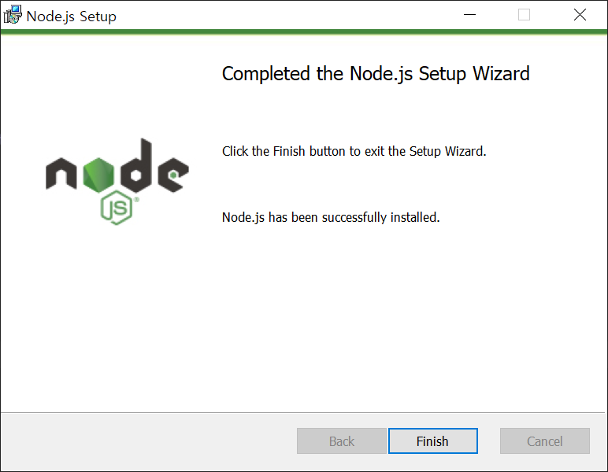{: width="90%", height="90%"}

 

cmd 창이 뜨면 [Enter] 키를 눌러서 계속 진행하면 됩니다.

| 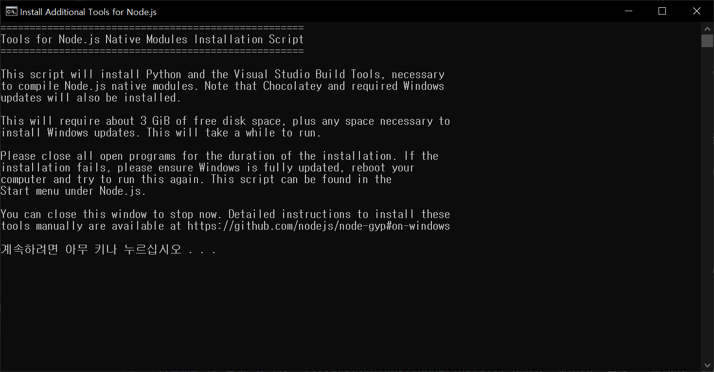 | 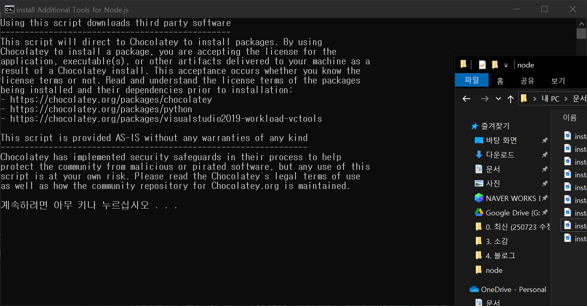 |

 

마지막으로 Powershell이 켜지며 필요한 패키지가 설치 혹은 업그레이드 되는 과정입니다.

마지막으로 [Enter]를 누르라는 화면이 나오면 [Enter]를 클릭하여 종료해주시면 됩니다.

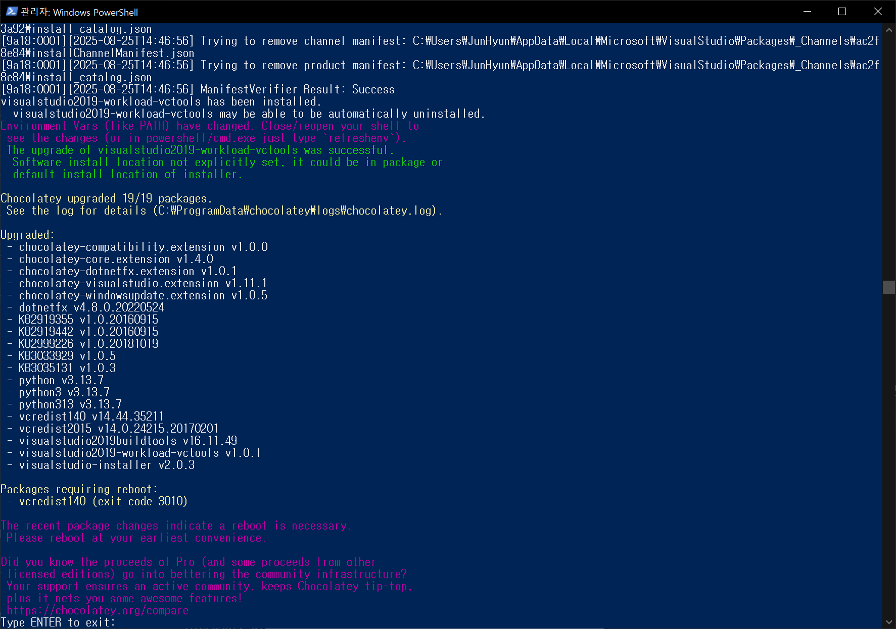{: width="90%", height="90%"}

 

여기까지 따라하셨다면 [cmd]에 진입해서 [node] 입력 후 [Enter]를 눌러 Node.js가 실행되는 것을 확인할 수 있습니다.

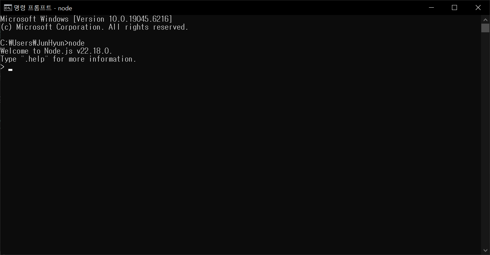{: width="90%", height="90%"}